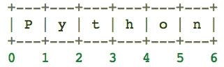

## 2. An informal introduction to Python

1. Comment in Python start with the hash character, `#`, and extend to the end of the physical line. A comment may appear at the start of a line or following whitespace or code, but not within a string literal.<br/>
<font color=#3333FF>Python中的注释以字符“`#`”开始，延续至整行结束。一条注释可能出现在一行的开始处，或处于空格后面，或处于代码后，但是不能出现在文字描述中。</font>
	
	```python
	# this is the first comment
	>>> spam = 1    # and this is the second comment
	...             # ... and now a thrid
	>>> text = "    # This is not a comment because it's inside quotes."
	``` 
		
2. Division(`/`) always returns a float. To do floor division and get an integer result (discard any fractional result), you can use the `//` operator; to calculate the reminder you can use `%`.<br/>
<font color=#3333FF>除号（`/`）通常返回浮点数。如果要做整除，得到一个整数结果（舍弃小数结果），你可以使用运算符`//`。如果要计算余数，你可以使用`%`。</font>
	
	```python
	>>> 17 / 3     # classic division return a float
	5.666666667
	>>> 17 // 3    # floor division discard the fractional part
	5
	>>> 17 % 3     # the % operator returns the reminder of the division
	2
	```
	
3. With Python, it is possible to use the `**` operator to calculate powers.<br/>
<font color=#3333FF>在Python中，可以使用`**`运算符来计算幂。</font>
	
	```python
	>>> 5 ** 2     # 5 squared
	25
	>>> 2 ** 7     # 2 to the power of 7
	128
	```

4. In interactive mode, the last printed expression is assigned to the variable `_` . This variable should be treated as read-only by the user. Don't explicitly assign a value to it -- you would create an independent local variable with the same name masking the built-in variable with its magic behavior.<br/>
<font color=#3333FF>在交互模式中，最后一条被打印出的表达式将被赋值给变量 `_` 。这个变量对于用户来说是只读的。不要显示给它赋值--这样做你将创建一个同名的本地变量，而覆盖了内置变量以及它的神奇功能。</font>

5. If you don't want characters prefaced by `\` to be interpreted as a special characters, you can use raw string by adding an `r` before the first quote.<br/>
<font color=#3333FF>如果你不想以 `\` 为前导的字母被解释为特殊字符，你可以在首个引号前添加 `r` 表示为<font face="Comic Sans MS" color=#FF6666>*原始字符串*</font>。</font>
	
	```python
	>>> print("c:\some\name")    # here \n means newline!
	c:\some
	ame
	>>> print(r"c:\some\name")    # note the r before the quote
	c:\some\name
	```

6. String literals can span multiple lines. One way is using triple-quote: `"""..."""` or `'''...'''`. End of line are are automatically included in the string, but it's possible to prevent this by adding a `\` at the end of the line.<br/>
<font color=#3333FF>文字描述可分散在多行中。一种方法是使用三等号：`"""..."""` 或者 `'''...'''`。行尾符会自动加入到字符串中，但是你可以通过在行尾加上一个 `\` 来阻止这种行为。</font>
	
	```python
	>>> print('''\
	... Usage: thingy [OPTIONS]
	...     -h
	...     -H hostname
	... ''')
	Usage: thingy [OPTIONS]
	    -h
	    -H hostname
	```

7. Strings can be concatenated ( glued together ) with the `+` oerator, and repeated with `*`.<br/>
<font color=#3333FF>字符串可以使用 `+` 运算符进行拼接（粘合在一起），使用 `*` 运算符进行重复。</font>
	
	```python
	>>> # 3 times 'un', followed by 'run'
	>>> 3 * 'un' + 'ium'
	'unununium'
	```

8. Two or more string literals (i.e. the ones encolsed between quotes) next to each other and automatically concatenated. This only works with two literals though, not with variables or expressions.<br/>
<font color=#3333FF>两个或多个文字描述并排在一起将自动拼接为一个字符串。这只适用于文字描述，不适用变量和表达式。</font>
	
	```python
	>>> 'Py' 'thon'
	'Python'
	>>> prefix = 'Py'
	>>> prefix 'thon'     # cant' concatenate a variable and a string literal
	Traceback...
	...
	SyntaxError: invalid syntax.
	```
	
9. There is no seperate character type, a character is simple a string of size one.<br/>
<font color=#3333FF>没有单独的字符类型，一个字符只是一个简单的长度为 **1** 的字符串。</font> 
	
10. Indices may alos be negative number, to start counting from the right. **Note** that since -0 is the same as 0. Negative indices start from -1.<br/>
<font color=#3333FF>索引也可以为负数，表示从右侧开始计算。**注意**，-0 和 0 是相同的，负数的索引从-1开始。</font>

	```python
	>>> word = 'Python'
	>>> word[0]     # character in position 0
	'P'
	>>> word[-1]     # last character
	'n'
	```

11. Slice indices have useful defaults: an omitted first index defaults to zero, an omitted second index defaults to the size of string being sliced.<br/>
<font color=#3333FF>分片索引有很有用的默认值。缺省第一个索引默认为 0，缺省第二个索引默认为此字符串的长度。</font>
	
	```python
	>>> word[:2]     # characters from the beginning to position 2 (excluded)
	'Py'
	>>> word[4:]     # characters from position 4 (included) to the end
	'on'
	```
	
12. **Note** how the start is always included, and the end always excluded. One way to remember how slices work is to think of the incides as pointing between characters, with the left edge of the first character numbered *0*. Then the right edge of the last character of a string of *n* characters has index *n*.<br/>
<font color=#3333FF>**注意**，开始的索引总是被包括，结束的索引总是被排除。有一个方法用来记住分片是如何工作的：把索引想成是指向字符之间的，第一个字符的左侧边界编号为*0*，那么长度为*n*的字符切片最后一个字符的右侧边界的索引是*n*。</font>
	
	

13. Attempting to use an index that is too large will result in an error. However, out of range slice indexes are handled gracefully when used for slicing.<br/>
<font color=#3333FF>试图使用超出范围的索引会引起错误。然而，超出范围的分片索引在用于分片时可以被优雅地处理。</font>
	
	```python
	>>> word[42]     # the word only has 6 characters.
	Traceback ...
	...
	IndexError: string index out of range
	>>> word[4:42]
	'on'
	>>> word[42:]
	''
	```
	
14. Python string can not be changed -- they are **immutable**. Therefore, assigning to an indexed position in the string results in an error.<br/>
<font color=#3333FF>Python字符串是不能改变的——它们是**不可变的**。所以，对字符串中索引位置赋值会引起错误。</font>
	
	```python
	>>> word[0] = 'J'
	Traceback ...
	...
	TypeError: 'str' object does not support item assignment
	```
	
15. Like string (and all other built-in *sequence* type), lists can be indexed and sliced.
<br/><font color=#3333FF>与字符串（和内置的所有*序列*类型）类似，列表也可以被索引和分片。</font>
	
	```python
	>>> squares = [1, 4, 9, 16, 25]
	>>> squares[0]     # indexing returns the item
	1
	>>> squares[3:]     # slicing returns a new list
	[16, 25]
	```
	
16. Unlike strings, which are **immutable**, lists are a **mutable** type. Assignment to slices is possible, and this can even change the size of the list or clear it entirely.<br/>
<font color=#3333FF>不同于字符串是**不可变的**，列表是一个**可变**的类型。对一个切片赋值是可以的，这甚至可以改变列表的大小或者全部清除列表。</font>
	
	```python
	>>> letters = ['a', 'b', 'c', 'd', 'e']
	>>> letters[2:5] = ['C', 'D', 'E']     # replace some values
	>>> letters
	['a', 'b', 'C', 'D', 'E']
	>>> letters[2:5] = []     # now remove them
	>>> letters
	['a', 'b']
	>>> letters[:] = []     # clear the list by replacing all the elements with an empty list
	>>> letters
	[]
	```
	
17. The `point()` function writes the value of the argument(s) it is given. Strings are printed without quotes, and a whitespace is inserted between items, so you can format things nicely. The keyword argument `end` can be used to avoid the newline after the output, or end the output with a different string.<br/>
<font color=#3333FF>`print()`函数打印所有给予的参数值。字符串打印时没有引号，各个参数之间会插入一个空格，以便你精细地格式打印。关键字参数`end`可以用于在打印结尾处消除换行，或者用一个别的字符串接在打印结尾处。</font>
	
	```python
	>>> i = 256 * 256
	>>> print('The value of i is', i)
	The value of i is 65536
	
	>>> a, b = 0, 1
	>>> while b < 100:
	...		print(b, end=', ')
	...		a, b = b, a + b
	1, 1, 2, 3, 5, 8, 13, 21, 34, 55, 89
	```
	
------
> * 本文英文内容摘抄至 [Python官网](https://docs.python.org/) 教程 [The Python Tutorial](https://docs.python.org/3/tutorial/) 中的 [An informal introduction to Python](https://docs.python.org/3/tutorial/introduction.html) 章节。
> * 本文中文内容为本人翻译，我已经尽力了。
	